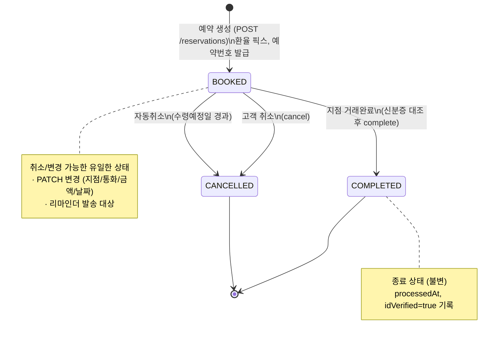
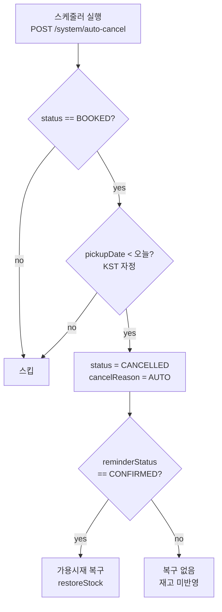

# 상태 전이 다이어그램 (State Machine)

예약(`Reservation.status`)의 생명주기입니다. 상태값은 3개: `BOOKED`(예약) / `COMPLETED`(완료) / `CANCELLED`(취소).

---

## 1. 상태 전이도



> COMPLETED / CANCELLED 는 **종료 상태(terminal)** 로, 이후 전이 없음.
> `BOOKED` 에서만 변경(PATCH)이 가능하며, 변경은 상태를 바꾸지 않고 필드만 갱신합니다.

---

## 2. 전이 규칙표

| From | To | 트리거 | 가드(선행조건) | 부수효과 |
|---|---|---|---|---|
| `∅` | `BOOKED` | 예약 생성 | 지점·통화·금액·날짜 검증 통과, 동의 완료 (재고 미확인) | 예약번호 발급, `rate` 픽스, `createdAt` 기록 |
| `BOOKED` | `BOOKED` | 예약 변경(PATCH) | 재입력값 재검증 | 필드 갱신 (상태 불변), 필요 시 `rate` 재픽스 |
| `BOOKED` | `BOOKED` | 방문예정 확인 | 재고 있음(`consumeStock` 성공) | `reminderStatus=CONFIRMED`, **예약시재 반영·가용시재 차감** |
| `BOOKED` | `COMPLETED` | 거래완료 | `idVerified = true` (지점 신분증 대조, 기존 POS 흐름) | `status=COMPLETED`, `processedAt` 기록 |
| `BOOKED` | `CANCELLED` | 고객 취소 | (취소 컷오프 정책 미확정, `// TODO`) | `status=CANCELLED` |
| `BOOKED` | `CANCELLED` | 자동취소 | `pickupDate < 오늘` | `status=CANCELLED` (배치) |
| `COMPLETED` | — | — | (종료) | 전이 불가 |
| `CANCELLED` | — | — | (종료) | 전이 불가 |

---

## 3. 자동취소 로직

- **판정 조건**: `수령기한(당일 KST 자정) 경과 AND 상태='예약'`. **리마인더 응답상태(방문예정확인/미응답)와
  무관하게 동일 적용** — 방문예정확인을 했어도 수령기한까지 POS 거래완료가 안 되면 똑같이 자동취소된다.
- 수령기한 = 수령예정일(`pickupDate`) **당일**. 당일까지는 리마인더 무응답이어도 취소하지 않음.
- **당일 경과(`pickupDate < 오늘`, KST)** 시 자동취소 → `CANCELLED` (`cancelReason='AUTO'`).
- **재고 복구(분기 처리)**:
  - 미응답(`NO_RESPONSE`/`NONE`)이었던 건: 애초 재고 미반영 → 복구 없음.
  - 방문예정확인(`CONFIRMED`)이었던 건: 확인 시점에 반영됐던 예약시재/가용시재를 **복구**(`restoreStock`).
- **노쇼 이력**: 두 경우 모두 `cancelReason='AUTO'` 로 동일하게 카운트된다.
- 날짜 산술은 로컬 TZ 영향을 받지 않도록 UTC 자정 기준으로 처리(`src/lib/date.js`), KST 달력과 동일한 결과.

### 노쇼 누적 차단
`cancelReason='AUTO'`(노쇼/자동취소)가 이메일 기준 `NOSHOW_LIMIT`(현재 2, `// TODO`) 이상 쌓이면 신규예약을
예약자정보 단계에서 차단한다. (고객취소 `CUSTOMER`는 카운트 제외)

### 동시성(재고 경쟁)
재고 경쟁은 **예약 생성 시점이 아니라 리마인더 '방문예정' 확인 시점**에 발생한다.
- **예약완료(8단계)**: 예약 레코드(상태=`예약`)만 생성하고 **재고를 반영하지 않는다.** 여러 고객이 같은 지점·통화에
  동시에 예약할 수 있다(오버부킹 허용).
- **리마인더 방문예정 확인**: 고객이 예약조회에서 "방문 예정" 버튼을 누르는 시점에 `confirmVisit`이
  `consumeStock`으로 재고를 재확인·차감한다(**예약시재 반영·가용시재 차감**). 남아있으면
  `reminderStatus=CONFIRMED`, 없으면 "다른 고객이 이미 확정하여 재고가 소진되었습니다" 안내(상태는 `예약` 유지).
- 재고 복구는 방문예정확인(차감 발생) 여부로 갈린다: 미응답 자동취소는 차감 전이라 복구 불필요, **방문예정확인 후
  미방문으로 자동취소**되는 건은 차감분을 복구한다(위 자동취소 로직 참고).
- 프로토타입 A(경쟁): `B004+USD` 재고 1개 + `rush@example.com`으로 조회되는 방문예정 미확인 예약 2건
  (첫 건 확인 성공 → 재고 1→0, 둘째 건 확인 시 소진 안내).
- 프로토타입 B(확인 후 미방문): `visit@example.com` 방문예정확인 예약 1건(`B002+USD`, 수령기한 2026-07-31,
  시드 재고에서 1 차감된 상태). 기준일을 그 이후로 넘겨 "자동취소 실행" → 자동취소 + 재고 복구 확인
  (시뮬레이션 바에 `재고 복구: N` 표시).

### 최대금액 하향
CEMS 한도관리에서 지점 최대금액을 낮춰도 **기존 예약 레코드는 불변**. 새 상한은 이후 신규 예약에만 적용
(`saveBranchMax`는 `reservations`를 일괄 수정하지 않음).

프로토타입 구현: `ReservationContext.runAutoCancel()` — 실제 스케줄러 대신 운영자 콘솔의
"자동취소 실행" 버튼 + "하루 넘기기"로 시간 경과를 시뮬레이션합니다.



---

## 4. 리마인더 상태 (부가)

`reminderStatus` 는 예약 상태와 **독립적인** 부가 상태로, 운영자 시재준비 리스트의 노출 여부에만 영향.

```
NONE(발송전) ──리마인더 발송──▶ NO_RESPONSE(무응답)
                                  │
                                  └─고객 방문확인 응답─▶ CONFIRMED(방문예정확인)
                                     (이 시점에 재고 차감: consumeStock 성공 시에만 전이)
```

> `NO_RESPONSE → CONFIRMED` 전이는 재고 차감을 동반한다. `consumeStock`이 실패하면(품절) 전이하지 않고
> "재고가 소진되었습니다" 안내만 표시한다.

| reminderStatus | 상태 | 시재준비 리스트 노출 |
|---|---|---|
| `CONFIRMED` | 방문예정 확인 | 노출 |
| `NO_RESPONSE` (수령일 미래) | 전일까지 무응답 | 기본 숨김 (직접조회는 가능) |
| `NO_RESPONSE` (수령일 당일) | 당일 무응답 | 노출 |
| — | 취소/자동취소(`CANCELLED`) | 미노출 |
