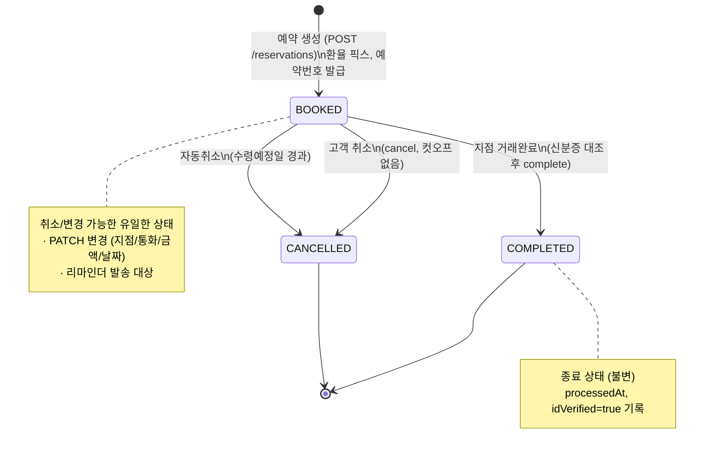
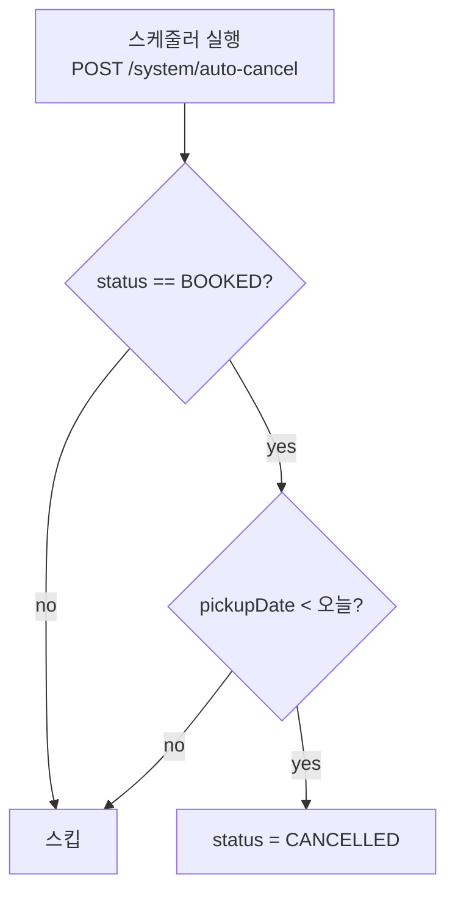

# 상태 전이 다이어그램 (State Machine)

예약(`Reservation.status`)의 생명주기입니다. 상태값은 3개: `BOOKED`(예약) / `COMPLETED`(완료) / `CANCELLED`(취소).

---

## 1. 상태 전이도



> COMPLETED / CANCELLED 는 **종료 상태(terminal)** 로, 이후 전이 없음.
> `BOOKED` 에서만 변경(PATCH)이 가능하며, 변경은 상태를 바꾸지 않고 필드만 갱신합니다.

---

## 2. 전이 규칙표

| From | To | 트리거 | 가드(선행조건) | 부수효과 |
|---|---|---|---|---|
| `∅` | `BOOKED` | 예약 생성 | 지점·통화·금액·날짜 검증 통과, 재고 있음, 동의 완료 | 예약번호 발급, `rate` 픽스, `createdAt` 기록 |
| `BOOKED` | `BOOKED` | 예약 변경(PATCH) | 재입력값 재검증, 재고 재확인 | 필드 갱신 (상태 불변), 필요 시 `rate` 재픽스 |
| `BOOKED` | `COMPLETED` | 거래완료 | `idVerified = true` | `status=COMPLETED`, `processedAt` 기록 |
| `BOOKED` | `CANCELLED` | 고객 취소 | 없음 (컷오프 없음) | `status=CANCELLED` |
| `BOOKED` | `CANCELLED` | 자동취소 | `pickupDate < 오늘` | `status=CANCELLED` (배치) |
| `COMPLETED` | — | — | (종료) | 전이 불가 |
| `CANCELLED` | — | — | (종료) | 전이 불가 |

---

## 3. 자동취소 로직

- **기준**: 수령기한 = 수령예정일(`pickupDate`) **당일**.
- 당일까지는 리마인더 무응답이어도 취소하지 않음.
- **당일 경과(`pickupDate < 오늘`)** 시 자동취소 → `CANCELLED`.
- 노쇼 제재 없음. 자동취소 외 불이익 없음.

프로토타입 구현: `ReservationContext.runAutoCancel()` — 실제 스케줄러 대신 운영자 콘솔의
"자동취소 실행" 버튼 + "하루 넘기기"로 시간 경과를 시뮬레이션합니다.



---

## 4. 리마인더 상태 (부가)

`reminderStatus` 는 예약 상태와 **독립적인** 부가 상태로, 운영자 시재준비 리스트의 노출 여부에만 영향.

```
NONE(발송전) ──리마인더 발송──▶ NO_RESPONSE(무응답)
                                  │
                                  └─고객 방문확인 응답─▶ CONFIRMED(방문예정확인)
```

| reminderStatus | 상태 | 시재준비 리스트 노출 |
|---|---|---|
| `CONFIRMED` | 방문예정 확인 | 노출 |
| `NO_RESPONSE` (수령일 미래) | 전일까지 무응답 | 기본 숨김 (직접조회는 가능) |
| `NO_RESPONSE` (수령일 당일) | 당일 무응답 | 노출 |
| — | 취소/자동취소(`CANCELLED`) | 미노출 |
